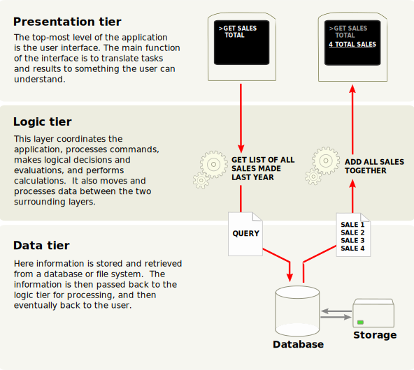
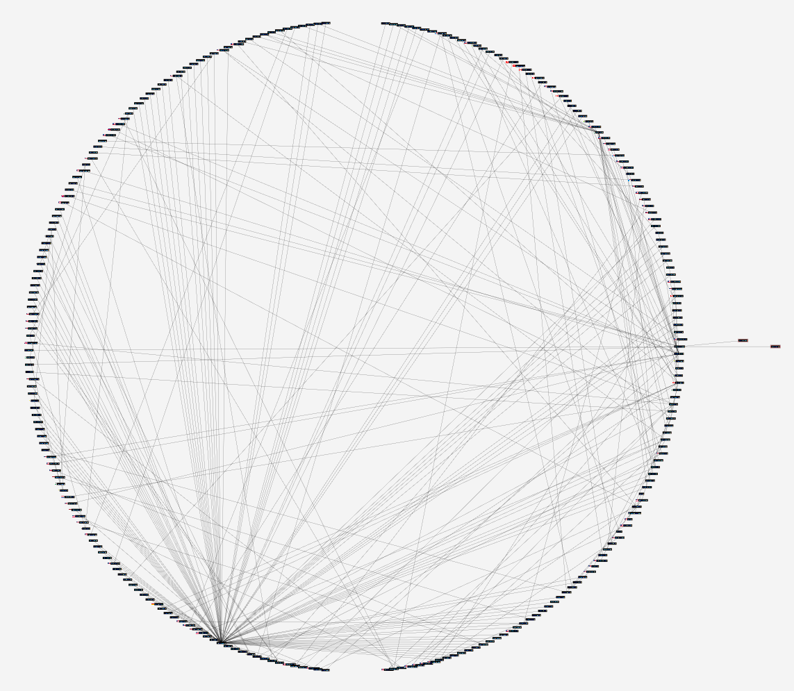

<div align="center">
<h1 align="center">

<br>Yuwen yorozuya LineBot
</h1>
<h3>◦ Building a customize AI-assistant Linebot for everyone.</h3>
<h3>◦ Clean Architecture provides a testable, maintainable, and scalable app.</h3>

<p align="center">


</p>


</div>

## 🏠 Yorozuya

"Yorozuya" is a fictional establishment in the Japanese manga and anime series "Gintama", operated by the protagonist,
Gintoki Sakata. Yorozuya is a business that handles various tasks and requests, ranging from finding lost items to
resolving disputes.

The project was named "Yorozuya" because it was hoped that the LineBot would make it easier for Line users to access
OpenAPI to solve problems, and also to commemorate the end of Gintama.


## 📒 Table of Contents

- [📒 Table of Contents](#-table-of-contents)
- [📍 Overview](#-overview)
- [🚀 Getting Started](#-getting-started)
- [👨‍🏫 Demo](#-demo)
- [📝 Note](#-note)
- [🔜 Next](#-next)
- [📄 License](#-license)

## 📍 Overview

The yuwen-yorozuya-linebot project is a feature-rich chat interface built on the LINE platform that enables seamless and
interactive communication. This project has undergone a significant transformation, adopting the principles of Clean
Architecture, which has not only enhanced its maintainability but also unlocked several key benefits.

- <b>Cleaner Code</b>: The separation of concerns and modularization result in cleaner, more organized code, making it
  easier to read and maintain.

- <b>Testability</b>: With well-defined interfaces and dependency injection, unit testing becomes straightforward,
  ensuring the reliability of the codebase.

- <b>Scalability</b>: The architecture's modular nature allows for easy expansion and addition of new features, making
  the project adaptable to future requirements.

- <b>Maintainability</b>: Clean Architecture promotes code maintainability, reducing the risk of technical debt and
  simplifying future updates and enhancements.

## ✨ Feature

yuwen-yorozuya-linebot serves as a dynamic chat agent chain with an array of essential features including:

### OpenAI Function Calling

In addition to its core features, this project implements OpenAI Function Calling. This means that developers can
encapsulate desired services as functions and incorporate them into the chatbot through the LangChain agent. We can
implement this in `src\infrastructure\tools\`.

### Language Model

The project leverages the LangChain framework, a powerful tool designed to simplify the integration of language models
into applications. Specifically, LangChain is used in this project to seamlessly connect with the OpenAI Language
Model (LLM), allowing developers to focus on application development without getting bogged down in the complexities of
language processing.

### Chat Memory

The ability to remember and recall previous conversations, providing a personalized user experience. Default is
PostgreSQL. You can use your memory repositorios by implementing the <b>BaseChatMemory</b> interface.

### System Messages

You can custom your LineBot's personality by setting the <b>CHATBOT_DESCRIPTION</b> in .env file.

## 🚀 Getting Started

### ✔️ Prerequisites

Before you begin, ensure that you have the following prerequisites installed:

1. Setup LINE Channel to get CHANNEL_SECRET and CHANNEL_ACCESS_TOKEN
   > ref:  [Day 12：帶著聊天機器人來到 LINE](https://ithelp.ithome.com.tw/articles/10221681)
2. Get SerpAPI Token
   > ref: [SerpAPI](https://serpapi.com/dashboard)
3. Get OpenAI Token
   > ref: [OpenAI-API-keys](https://platform.openai.com/account/api-keys)
4. Setup PostgreSQL and get connect string
   > You can use some PostgreSQL provider like: ElephantSQL, Vercel Postgre...etc.
   I recommand [Zeabur](https://zeabur.com/zh-TW) for a web-hosting PostgreSQL because you can create a project and run
   the LineBot and PostgreSQL in the same platform. So fast! So easy! So convenient!
5. Setup environment variables by creating a <b>.env</b> file
    ```
    CHANNEL_SECRET=
    CHANNEL_ACCESS_TOKEN=
    OPENAI_API_KEY=
    PORT=
    SERPAPI_API_KEY=
    SQLALCHEMY_DATABASE_URI=
    CHATBOT_DESCRIPTION=
    CHATBOT_LANGUAGE=
    ```

### 📦 Installation

1. Clone the yuwen-yorozuya-linebot repository:

```sh
git clone https://github.com/ttpss930141011/yuwen-yorozuya-linebot.git
```

2. Change to the project directory:

```sh
cd yuwen-yorozuya-linebot
```

3. Install the dependencies:

```sh
Poetry install
```

### 🧪 Running Tests

```sh
pytest
```

### 🎮 Using yuwen-yorozuya-linebot

```sh
python app.py
```

### 🚀 Deployment

#### For local

1. Use ngrok

    ```
    ngrok http {PORT}
    ```

2. Then put the forwarding url to LineBot Messaging API Webhook url settings.

   </img>

   </img>

#### For Zeabur

1. New project

   </img>

2. New services to add PostgreSQL and Git repository

   </img>
   </img>
3. Public the networking

   </img>
4. Setup environment variables

   </img>

---

## 👨‍🏫 Demo

| Keeping the Memory Alive            | Search information on the internet  | Group assistant                     |
|-------------------------------------|-------------------------------------|-------------------------------------|
|  |  |  |

---

## 📝 Note

### Clean Architecture Transformation

In the quest for code quality, maintainability, and scalability, the yuwen-yorozuya-linebot project has embraced Clean
Architecture principles. Here's how Clean Architecture has influenced this project's development:

- <b>Flask + LINE SDK</b>: The project continues to utilize Flask and the LINE SDK as its core technologies, but the key
  transformation lies in the architecture.

- <b>Blueprints as Handlers</b>: In the Clean Architecture paradigm, message handlers are treated as blueprints. This
  approach decouples the handling of messages from the application's core logic, making the codebase more modular and
  maintainable.

- <b>Controller and Usecase Separation</b>: The traditional controller and use case layers have been restructured,
  promoting a separation of concerns. Controllers are responsible for handling incoming requests and orchestrating the
  flow, while use cases encapsulate the application's business logic.

- <b>Dependency Injection</b>: Extensive use of dependency injection enhances code cleanliness, testability, and
  extensibility. Dependencies are injected into components, reducing tight coupling and simplifying unit testing.

### Final

I am used to implement 3-tier architecture in my project. Accidentally, I heard a sharing by a senior software engineer
in development community. He was talking about what is the adventages he felt when he migrated the application to the
another application from other company.

| 3-tier architecture                                                                            | Clean architecture                            |
|------------------------------------------------------------------------------------------------|-----------------------------------------------|
|  |  |

I started to study what is the Clean Architectre by reading two
books "[Clean Architecture: A Craftsman's Guide to Software Structure and Design](https://a.co/d/b6AwM2R)"
and "[Architecture Patterns with Python: Enabling Test-Driven Development, Domain-Driven Design, and Event-Driven Microservices](https://a.co/d/dhmMraK)".

Although the project I made in formar job didn't have too complicated dependency like "Big Ball of yarn", I can imagine
it will be annoying if I gonna change infrustructure or framework one day. In the project, I wrote many interfaces to
make dependency to easily inject. I think a large number of dependency inversions is one of the important aspects why
Clean Architecture is attractive.

</img>

Finally, I will continue to delve deeper into Clean Architecture, especially with regards to the implementation of
entities and the definition of value objects. I'm not yet entirely familiar with these concepts in the context of this
project, so my plan is to further study and explore them in greater detail.

---

## 🔜 Next

The following is todo-list on LineBot:

- [x] Implement muting and unmuting functions
- [ ] Invoke LineBot by calling a key word.(it's too noisy in group.)
- [ ] Give YouTube link and return video summary
- [ ] Give the file and start the document conversation

---

## 📄 License

This project is licensed under the MIT License. See
the [LICENSE](https://docs.github.com/en/communities/setting-up-your-project-for-healthy-contributions/adding-a-license-to-a-repository)
file for additional info.
