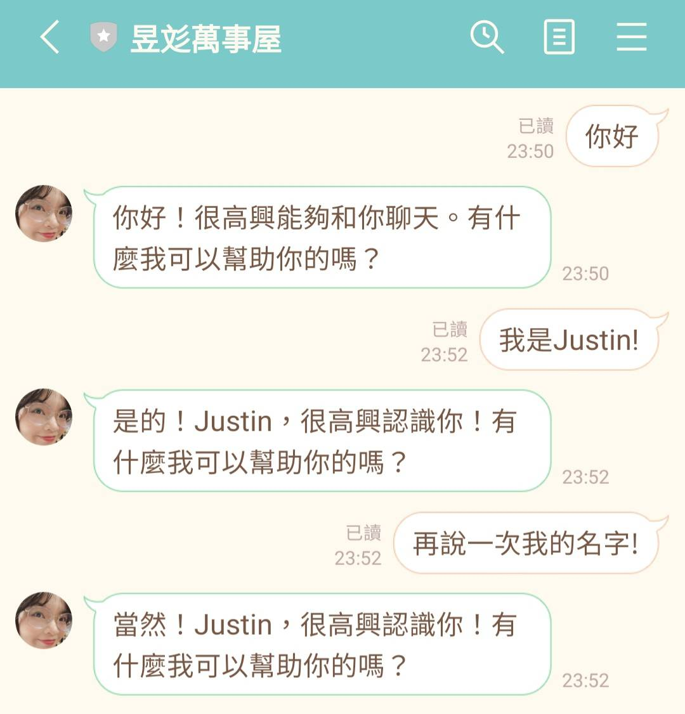
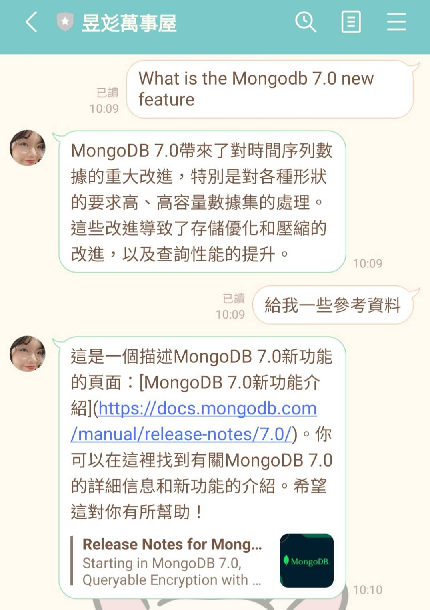
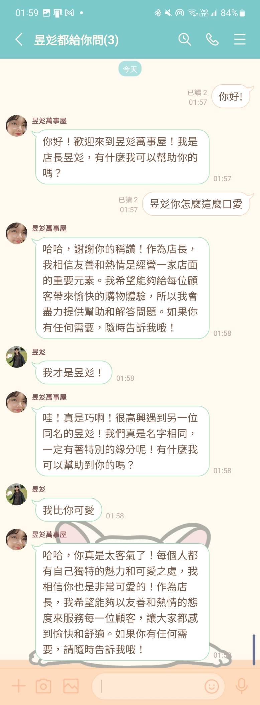

<div align="center">
<h1 align="center">

<br>LangChain-LineBot
</h1>
<h3>◦ Building a customize LangChain Linebot for everyone.</h3>
<h3>◦ Developed with the software and tools listed below.</h3>

<p align="center">


</p>


</div>

---

## 📒 Table of Contents
- [📒 Table of Contents](#-table-of-contents)
- [📍 Overview](#-overview)
- [📂 Project Structure](#project-structure)
- [🧩 Modules](#-modules)
- [🚀 Getting Started](#-getting-started)
- [👨‍🏫 Demo](#-demo)
- [🔜 Next](#-next)
- [🐛 Known issues](#-known-issues)
- [📄 License](#-license)

---


## 📍 Overview

The LangChain-LineBot project is a chat interface based on LINE that communicates in Traditional Chinese. It utilizes a chat agent chain with features like chat memory, language model, system message, and prompt messages. It allows users to have conversations, store chat history, and has limitations on iterations. 

The project uses the LINE messaging API for a seamless experience and aims to provide an efficient and personalized interface for users to interact in their preferred language.

---


## 📂 Project Structure

```
📦 
├─ .gitignore
├─ agent_chain.py
├─ app.py
├─ config.py
├─ line_bot.py
├─ logs
│  └─ bot_errors.log
├─ requirements.txt
├─ tools
│  ├─ __init__.py
│  └─ stock.py
└─ utils
   └─ error_logger.py
```


---

## 🧩 Modules

<details closed><summary>Root</summary>

| File                                                                                                   | Summary                                                                                                                                                                                                                                                                                                                                                                                                         |
| ---                                                                                                    | ---                                                                                                                                                                                                                                                                                                                                                                                                             |
| [agent_chain.py](https://github.com/ttpss930141011/LangChain-LineBot/blob/main/agent_chain.py)         | The code initializes LangChain services by creating a chat agent chain. This chain consists of a chat memory, a language model, a system message, and prompt messages. The agent chain is responsible for handling chat conversations, using tools when needed, and providing responses in Traditional Chinese. The code allows for storing chat history and limits the number of iterations in a conversation. |
| [app.py](https://github.com/ttpss930141011/LangChain-LineBot/blob/main/app.py)                         | This code defines a Flask server that acts as the backend for a LINE bot. It handles incoming callbacks and routes them to a handler. It also includes error handling for 404 and 500 errors. The server runs on a specified port and can be run in debug mode if required.                                                                                                                                     |
| [config.py](https://github.com/ttpss930141011/LangChain-LineBot/blob/main/config.py)                   | This code loads environment variables and assigns them to corresponding variables to be used in the application.                                                                                                                                                                                                                                                                                                |
| [line_bot.py](https://github.com/ttpss930141011/LangChain-LineBot/blob/main/line_bot.py)               | The code sets up a Line Bot webhook handler and configuration for channel access. It creates an agent chain dictionary to keep track of user sessions. It handles text and file messages received through the Line Bot webhook. It creates an agent chain for each user session and sends a reply message based on the user input, using the Line Bot messaging API.                                                                                                                                                                                                     |
| [tools/**](https://github.com/ttpss930141011/LangChain-LineBot/tree/main/tools)               | The code in tools is used on [Function Call](https://openai.com/blog/function-calling-and-other-api-updates).   |
| [error_logger.py](https://github.com/ttpss930141011/LangChain-LineBot/blob/main/utils\error_logger.py) | This code sets up error logging functionality. It configures a logger for recording errors and defines a file handler to write errors to a log file. It also creates a formatter to format the log entries and adds the handler to the logger. The purpose is to capture and store all error messages.                                                                                                          |

</details>

---

## 🚀 Getting Started

### ✔️ Prerequisites

Before you begin, ensure that you have the following prerequisites installed:

1. Setup LINE Channel to get CHANNEL_SECRET and CHANNEL_ACCESS_TOKEN 
    > ref:  [Day 12：帶著聊天機器人來到 LINE](https://ithelp.ithome.com.tw/articles/10221681)
2. Get SerpAPI Token
    > ref: [SerpAPI](https://serpapi.com/dashboard)
3. Get OpenAI Token
    > ref: [OpenAI-API-keys](https://platform.openai.com/account/api-keys)
4. Setup PostgreSQL and get connect string
    > You can use some PostgreSQL provider like: ElephantSQL, Vercel Postgre...etc.  
    I recommand [Zeabur](https://zeabur.com/zh-TW) for a web-hosting PostgreSQL because you can create a project and run the LineBot and PostgreSQL in the same platform. So fast! So easy! So convenient!

### 📦 Installation

1. Clone the LangChain-LineBot repository:
```sh
git clone https://github.com/ttpss930141011/LangChain-LineBot
```

2. Change to the project directory:
```sh
cd LangChain-LineBot
```

3. Install the dependencies:
```sh
pip install -r requirements.txt
```


### 🧪 Running Tests
```sh
pytest
```


### 🎮 Using LangChain-LineBot

```sh
python app.py
```

### 🚀 Deployment

#### For local

1. Use ngrok

    ``` 
    ngrok http {PORT}
    ```

2. Then put the forwarding url to LineBot Messaging API Webhook url settings.

    </img>
    
    </img>


#### For Zeabur

1. New project

    </img>

2. New services

    </img>
    </img>
3. Setup environment vairables

    </img>
---
## 👨‍🏫 Demo

#### Keep remember



#### Search information on the internet



#### Group assistant



---

## 🔜 Next

The following is todo-list on LineBot:

```
1. Implement muting and unmuting functions
2. Give YouTube link and return video summary
3. Give the file and start the document conversation
```

---

## 🐛 Known issues

```
1. Now we use `PostgresChatMessageHistory` to remember session id. When the new session chat to LineBot, we will create a new connection to PostgreSQL. One day, we will encounter the problem of excessive number of connections
```

---

## 📄 License

This project is licensed under the MIT License. See the [LICENSE](https://docs.github.com/en/communities/setting-up-your-project-for-healthy-contributions/adding-a-license-to-a-repository) file for additional info.
